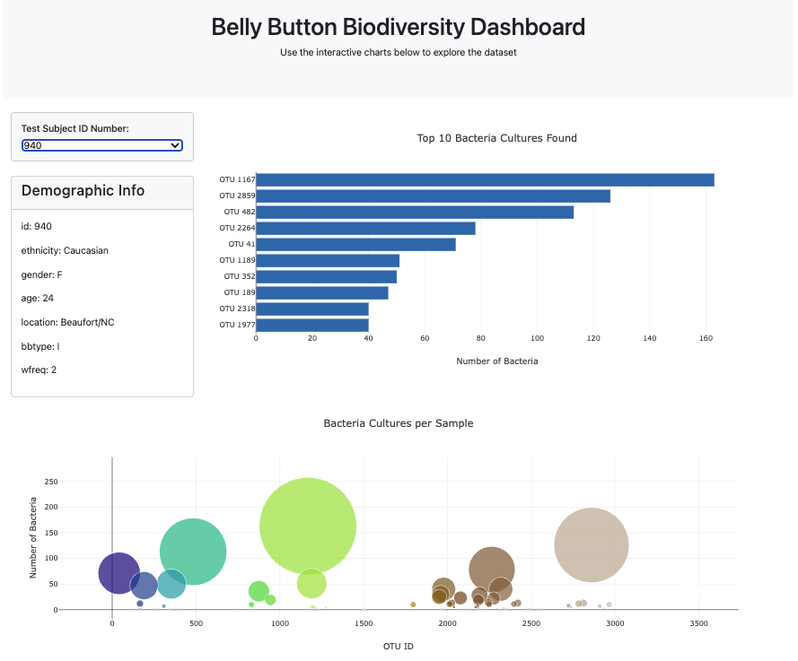

# JavaScript Belly Button Biodiversity App
**Creator**: Angelina Murdock  
**Date**: March 2025

## Table of contents
- [Overview](#overview)
- [Deployment](#deployment)
- [Features](#features)
- [Methodology](#methodology)
- [Resources](#resources)

## Overview
An interactive dashboard built with **JavaScript** to explore the biodiversity of belly buttons. Users can select individual test subjects to view the types and quantities of bacteria present in their samples. The app features dynamic charts and panels that visualize microbial data and demographic information in an engaging and informative way.

### Dashboard Example:

## Deployment
This app is deployed on **GitHub Pages**: 
    
- [Click here to deploy the app](https://angelinamurdock.github.io/belly-button-challenge/)

## Features
`samples.json`: Stores demographic data and bacterial culture samples for each test subject.

`app.js`:
- Builds a bar chart showing the top 10 bacteria cultures per subject
- Creates a bubble chart to visualize bacterial presence by OTU ID
- Displays demographic info by dynamically updating metadata panel

`index.html`: Serves as the main interface, linking the visualizations and scripts together.

## Methodology
### Data Processing and Visualization
**JavaScript Functions**: The app relies on JavaScript functions to handle data extraction, dynamic visualization updates and interactivity. Key functions include:
- Loading and parsing JSON data from `samples.json`.
- Uploading charts and panels based on user interaction.

**Plotly Data Visualizations**: The app uses Plotly to create interactive bar and bubble charts. Plotly allows users to interact with the data points, making the visualizations both informative and engaging.

## Resources
* [Belly Button Biodiversity Dataset](https://robdunnlab.com/projects/belly-button-biodiversity/) 
* [Plotly Documentation](https://plotly.com/javascript/)
* **DU Bootcamp Module 14:** Utilized challenge files and class materials from the bootcamp.
* **ChatGPT:** Assisted with code explanations and debugging.
